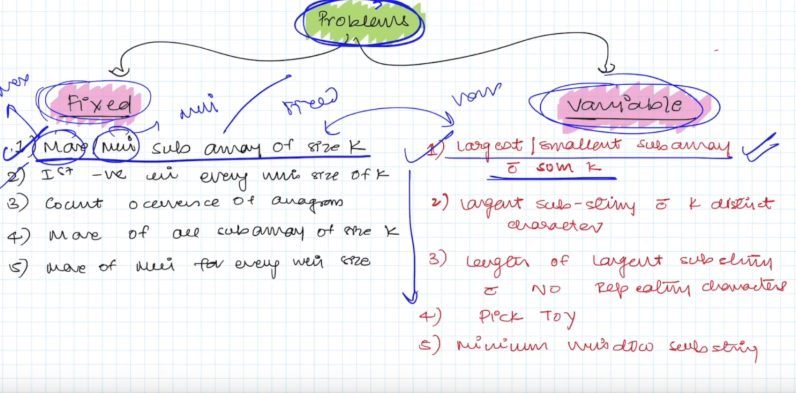

# Identification

Given items:
window size(fixed/variable)
array/string
To find out subarray/substring(elements order cannot change and elements are coninous)
maximum/minimum/smallest/largest

# Types

fixed --> Window size is given
variable --> we may need to find out window size.

Problems to be solved.
